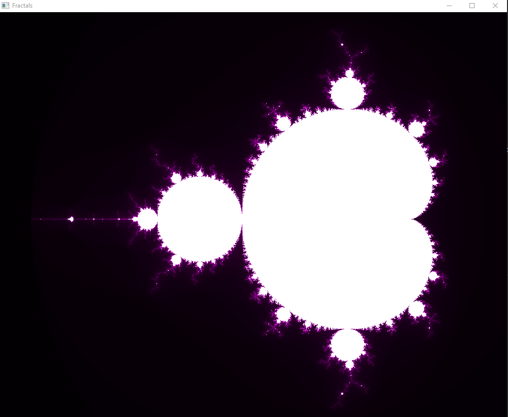
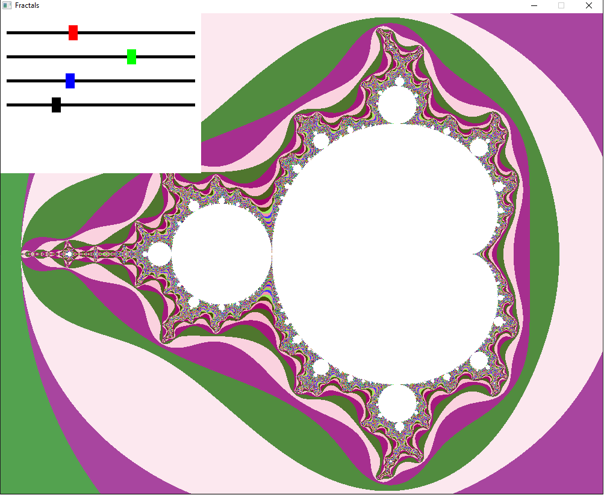
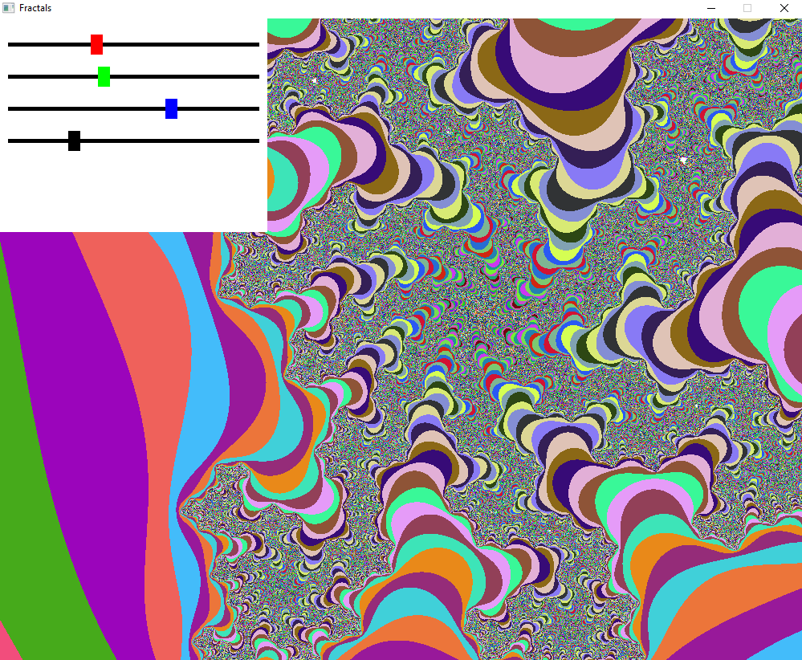
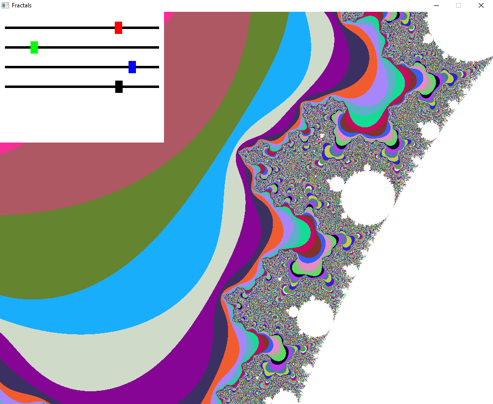

# C_SDL_Fractals

This a personnal project, it renders a Mandelbrot Set using SDL2 for rendering.  
To run this you'll need `SDL2` installed and the `pthread` library.  
To compile and run, run this command : `cd src && make && ./Fractals`.  

This is an old project, there is no syncrhonisation between threads, GUI could also be improved..  
Here are some images :  
  
  
## V2
The three buttons allow you to change the color and the black button the number of iterations.
  
 
  
