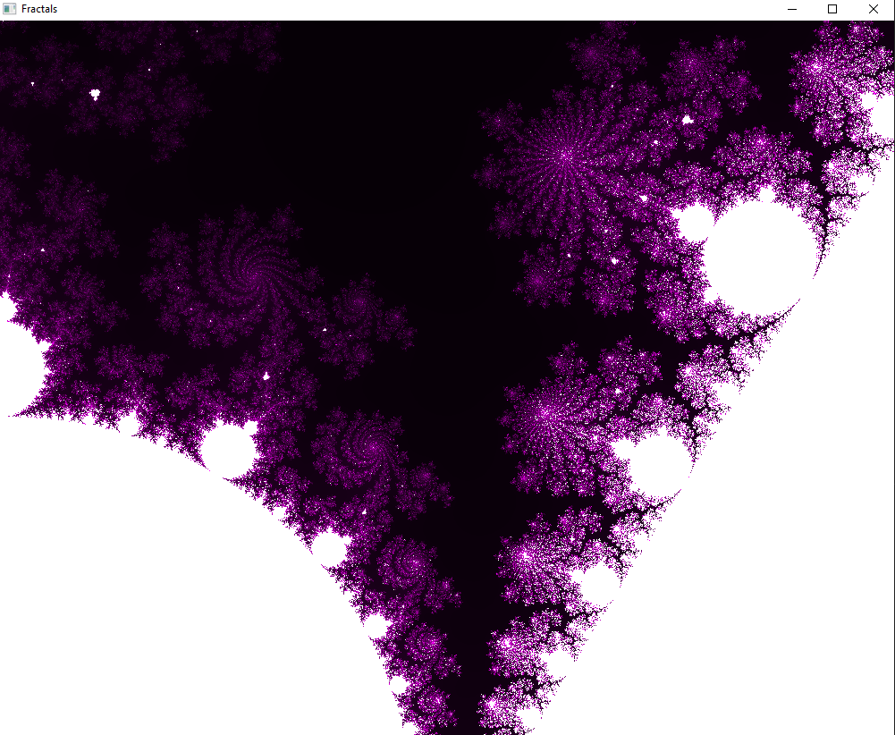

# C_SDL_Fractals

This a personnal project, it renders a Mandelbrot Set. It uses SDL2, pthread_win32 (for windows compatibility).

To run this project, depending on your OS, you'll need :  
`Windows` -> All libraries are provided:
  -mingw  

To compile the project, run this command :  
`gcc src/main.c src/fractals.c src/fractals.h -o ./Fractals.exe -I include -L lib -lmingw32 -lSDL2main -lSDL2 -lpthreadVC2; ./Fractals.exe`

`linux` :
For linux you'll need to install SDL2, then : `make ; ./Fractals` and it will work.

Here are some images :  
  
  
## V2
The three buttons allow you to change the color and the black button the number of iterations.
  
 
  